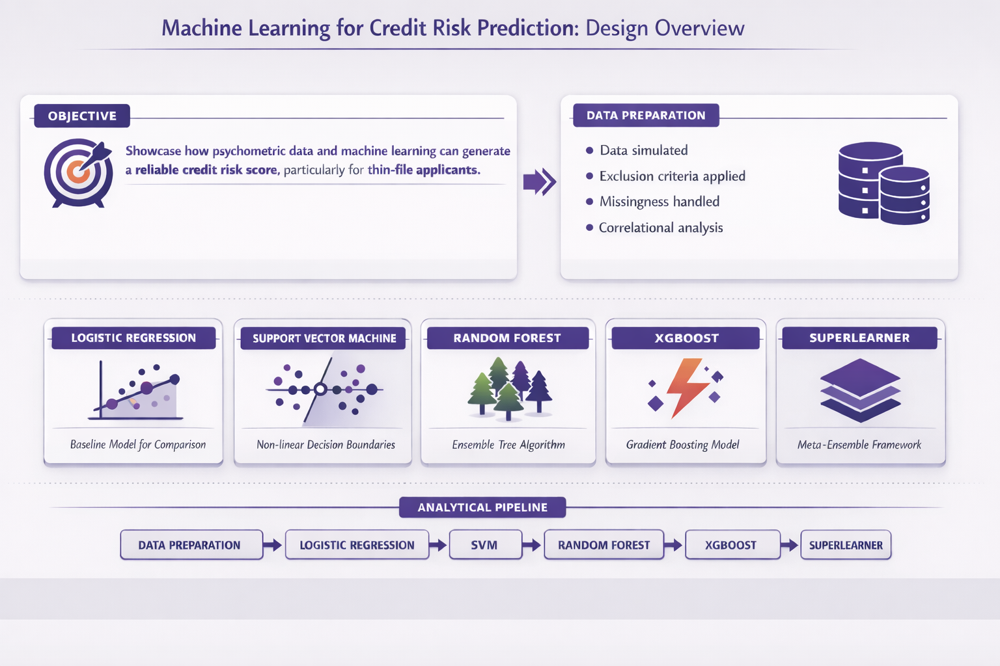

# Machine-Learning-for-Credit-Prediction
This analysis demonstrates how psychometric data and advanced ML techniques can be used to create a reliable credit score for people with a limited credit history (thin-file applicants). 

---

## Important notes

- This analysis uses **real Dynamic Risk Assessment data**
- DRA variables have been generalized or renamed in this public version
- **All financial data** (accounts, arrears, age on book, bad outcome) is simulated 
- No real candidate or client information is included
- Minor differences in model performance compared to the original analysis are expected due to simulation noise 

---

## Methods

We tested the following models: 
- Logistic regression (baseline model)
- SVM
- Random Forest
- XGBoost
- SuperLearner

---

## How to view the report

The full rendered report is available via **GitHub Pages**: 

https://ax-consult-group.github.io/Machine-Learning-for-Credit-Prediction-Phase1/

---

### Technologies used
The analysis was conducted in R using the following packages:

### Analysis
- lm.beta
- e1071
- randomForest
- xgboost
- SuperLearner

### Visualisation & reporting
- ggplot2
- dplyr
- kableExtra
- jtools
- knitr
- shapviz
- pdp

R version 4.5.2 (2025-10-31)
RStudio Version 2026.01.0+392 
